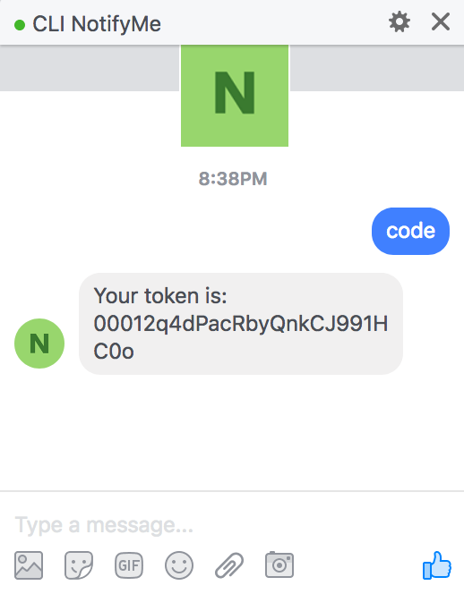

<div align="center">
    <h2>clinotify.me</h2>
    <p align="center">
        <p>Get notified when your command finish executing</p>
    </p>
</div>


## Contents

* [Installation](#installation)
* [Usage](#usage)
* [Notifiers](#notifiers)
    * [Messenger](#messenger)
* [Use cases](#use-cases)
* [Todo](#todo)
* [License](#license)

## Installation

### Build from source

`clinotify.me` client is written in Golang, to build it from source you need to have `go` installed and your `GOPATH` configured (default to `~/go` in go 1.9)

Once done, `get` the code by running:
```shell
go get github.com/think-it-labs/clinotify.me
```

NOTE: the command above will download the repo into your `GOPATH` and build it for you. Resulting binary can be found in `$GOPATH/bin`
### Prebuild binary

## Notifiers
For now only Messenger is implemented as a notifier. Feel free to hack into the project  and implement other notifiers.
### Messenger
By using Messenger notifier you will get notified via Facebook messenger.

First you need to get your `token` by talking to the [clinotifier.me](https://www.facebook.com/clinotify.me/) Chat Bot. This can be done by sending `code` to the bot as shown in picture below:
<p align="center">
    
</p>

Now that you have your token, edit your `~/.notifyme` config file so it looks like this:

```json
{
    "messenger_token": "YOUR_TOKEN_HERE",
}
```

NOTE: You can get your token again if needed by sending `code` again to the Chat Bot

## Usage

First you need to configure your [notifiers](#notifiers) by setting the right values (mainly tokens) in your `~/.notifyme` config file.

To get notified when a command finish executing just prepend `notifyme` to your command and let the magic happen.
```
$ notifyme COMMAND ARG1 ARG2 ...
```

For example to get notified when a Make build finish the command will looks like:

```
$ notifyme make -j 4
```
## Use Cases
Use cases for `notify.me` are uncountable, but here is some tasks regulary developers wants to be notified about their status, 

- Cron jobs
- Long running builds
- Backups
- etc.

`climotify.me` is making your life simpler? tell us how are you using it :smile: !

## Todo

- Add flags through environment variables
- Enrich the configuration and add filters (e.g: only send erroned commands)
- Support other notifiers
    - Slack
- Add a re-execute functionality

## License

This repository has been released under the [MIT License](LICENSE)

------------------
Made with ♥ by [Think.iT](http://www.think-it.io/).